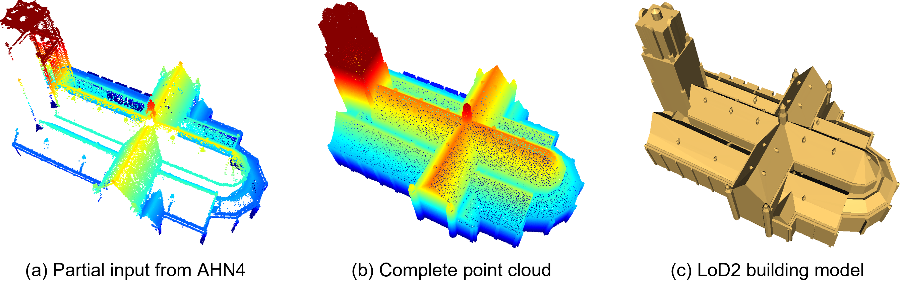

# Building-PCC-Building-Point-Cloud-Completion-Benchmarks
This is the implementation of the Builiding-PCC paper: [*Building-PCC: Building Point Cloud Completion Benchmarks*](https://isprs-annals.copernicus.org/articles/X-4-W5-2024/179/2024/).
This repository contains scripts for generating Building-PCC data, links for data downloads, test codes for state-of-the-art methods, pre-trained models, and evaluation results.

<div align="center">    

</div>

## Code and Data generation
In the code directory, methods such as PCN, FoldingNet, TopNet, GRNet, SnowflakeNet, PoinTr, and AdaPoinTr are organized within the PoinTr folder, while AnchorFormer is located in its own separate folder. 
For usage and testing instructions for each method, please refer to the README files in the corresponding subfolders.

The fme folder houses the building instance generation pipeline, and the scripts directory contains scripts for point cloud sampling.

## Download dataset
You can access the datasets via the links provided below, which include a small demo dataset for initial testing, as well as the full dataset comprising training, validation, and testing splits.

| dataset          | url                                                                                                                                                    | Size    |
|------------------|--------------------------------------------------------------------------------------------------------------------------------------------------------|---------|
| BuildingPCC-demo | [[SurfDrive](https://surfdrive.surf.nl/files/index.php/s/GCFF4eFPBS1QFP9)] / [[BaiDuYun](https://pan.baidu.com/s/1dQRpbP5fgEVUcuo2V2qYqg)] (code:as24) | 4.6 MB  |
| BuildingPCC-50k  | [[SurfDrive](https://surfdrive.surf.nl/files/index.php/s/eBJkxS6M71VLaJq)] / [[BaiDuYun](https://pan.baidu.com/s/1sbzTSU1CNDmlV2qHHCzUww)] (code:h2b9) | 7.43 GB | 

## Download pretrained models
Pre-trained models for all the methods tested are provided:

| dataset  | url| CD-L1 | F-Score |
| --- | --- |  --- | --- |
| PCN | [[SurfDrive](https://surfdrive.surf.nl/files/index.php/s/0LG9hj2cPSJYKVv)] / [[BaiDuYun](https://pan.baidu.com/s/1A7v4wp1tHn7WR4lvpyIfGA)] (code:2s62) | 6.12 | 39.5% |
| FoldingNet | [[SurfDrive](https://surfdrive.surf.nl/files/index.php/s/yrLwrOUClXrqq4C)] / [[BaiDuYun](https://pan.baidu.com/s/1rtgaDuBpCOsaZ_Ta9OnhXw)] (code:vvqm) | 4.92 | 34.0% |
| TopNet | [[SurfDrive](https://surfdrive.surf.nl/files/index.php/s/5r4YvctnY3x8QQt)] / [[BaiDuYun](https://pan.baidu.com/s/1FMvqRyk8L41eHdQia_nM3w)] (code:k9hd) | 6.43 | 26.5% |  
| GRNet | [[SurfDrive](https://surfdrive.surf.nl/files/index.php/s/8CELyqrWcHySywV)] / [[BaiDuYun](https://pan.baidu.com/s/1vvcCPN-rKZDGE5XnF9pNXw)] (code:mr4l) | 5.05 | 43.1% | 
| SnowflakeNet | [[SurfDrive](https://surfdrive.surf.nl/files/index.php/s/ezGAYlqw7qesBdH)] / [[BaiDuYun](https://pan.baidu.com/s/1y3Mi-nPusTV2Mof2biIdXA)] (code:sga2) | 6.61 | 60.9% |
| PoinTr | [[SurfDrive](https://surfdrive.surf.nl/files/index.php/s/4GGiv2OE3EwbTtN)] / [[BaiDuYun](https://pan.baidu.com/s/1DmUN7SIkTNy6l2Fvbzmr1w)] (code:qmsd) | 1.40 | 54.8% |
| AnchorFormer | [[SurfDrive](https://surfdrive.surf.nl/files/index.php/s/5QT5ou6hOy2XuUd)] / [[BaiDuYun](https://pan.baidu.com/s/133CIj3uMLHo2Yjx6CmFHoQ)] (code:7hev) | 1.46 | 65.8% |
| AdaPoinTr | [[SurfDrive](https://surfdrive.surf.nl/files/index.php/s/YNSI3jgJFaBBUiX)] / [[BaiDuYun](https://pan.baidu.com/s/1UDEEBDjxJfHIsJnrr3wX7A)] (code:xf1q) | 1.42 | 70.2% |

## Citation
If you find our work useful in your research, please consider citing: 
```
@Article{isprs-annals-X-4-W5-2024-179-2024,
AUTHOR = {Gao, W. and Peters, R. and Stoter, J.},
TITLE = {Building-PCC: Building Point Cloud Completion Benchmarks},
JOURNAL = {ISPRS Annals of the Photogrammetry, Remote Sensing and Spatial Information Sciences},
VOLUME = {X-4/W5-2024},
YEAR = {2024},
PAGES = {179--186},
URL = {https://isprs-annals.copernicus.org/articles/X-4-W5-2024/179/2024/},
DOI = {10.5194/isprs-annals-X-4-W5-2024-179-2024}
}
```

## License
This implementation is free software; you can redistribute it and/or modify it under the terms of the 
GNU General Public License as published by the Free Software Foundation; either version 3
of the License or (at your option) any later version. The full text of the license can be
found in the accompanying 'License' file.

If you have any questions, comments, or suggestions, please contact me at <i>gaoweixiaocuhk@gmail.com</i>

[<b><i>Weixiao GAO</i></b>](https://3d.bk.tudelft.nl/weixiao/)

May. 1st, 2024


